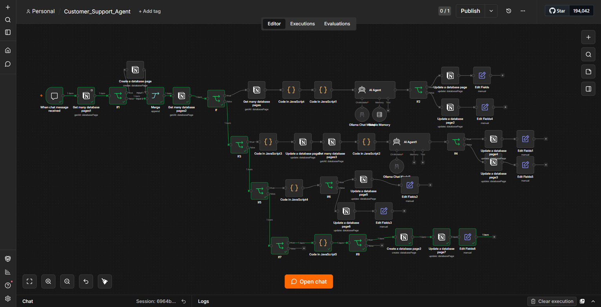

#  AI Customer Support Agent

An AI-powered Customer Support Agent built using **n8n**, **Ollama**, and **Notion**.

This workflow provides intelligent customer support by answering FAQs from a Notion Knowledge Base, maintaining conversation state, collecting customer information, and automatically creating support tickets when an answer cannot be found.

---

# Features

- ✅ Stateful conversations using Notion
- ✅ AI-powered FAQ retrieval
- ✅ Category-based knowledge search
- ✅ Automatic support ticket creation
- ✅ Customer email collection
- ✅ Conversation state management
- ✅ Notion Knowledge Base integration
- ✅ Support Ticket database
- ✅ Session tracking
- ✅ Multi-step workflow automation

---

# Technologies Used

- n8n
- Ollama
- Notion
- JavaScript
- AI Agents
- Workflow Automation

---

#  Screenshots

## Workflow



---

## Knowledge Base


---

## Support Tickets


---

## Chat Demo


---

#  Workflow Overview

1. User asks a question.
2. AI searches the Knowledge Base.
3. If an answer exists:
   - Responds immediately.
4. If no answer exists:
   - Requests a category.
5. Searches again using the selected category.
6. If still no answer:
   - Offers support ticket creation.
7. If accepted:
   - Collects customer email.
   - Creates a support ticket.
   - Resets the conversation.

---

#  Repository Structure

```
AI-Customer-Support-Agent-n8n
│
├── images/
├── workflow/
│   └── Customer_Support_Agent.json
├── README.md
└── LICENSE
```

---

#  Import Workflow

1. Download the workflow JSON.
2. Open n8n.
3. Click **Import Workflow**.
4. Configure your Notion credentials.
5. Configure your Ollama connection.
6. Start chatting.

---

#  Future Improvements

- Human agent dashboard
- Email notifications
- Slack integration
- Admin panel
- Analytics dashboard
- Semantic vector search

---

#  Author
**Vaibhav**

Built using n8n + Ollama + Notion.
**Vaibhav**

Built using n8n + Ollama + Notion.
